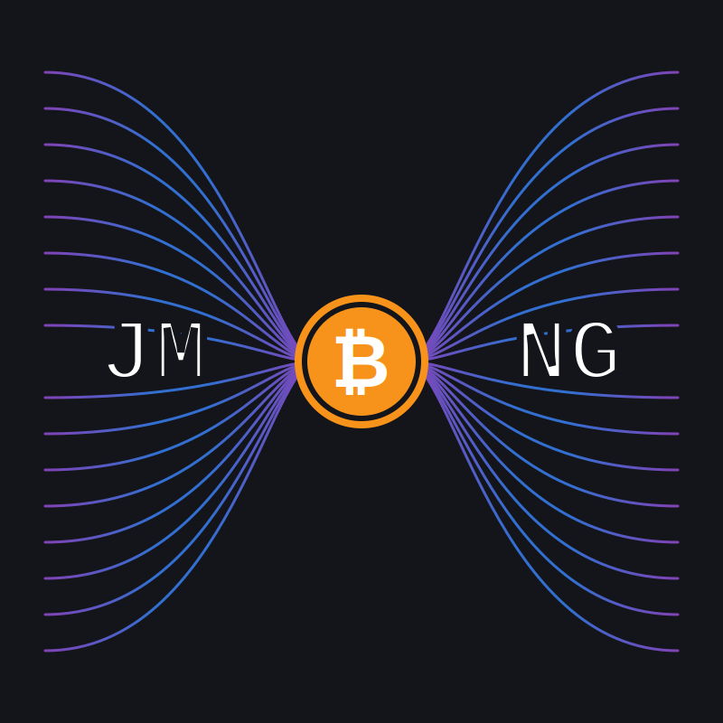

<p align="center">
  
</p>

# JoinMarket NG

JoinMarket NG is a modern implementation of the JoinMarket CoinJoin protocol.

It is wire-compatible with the reference JoinMarket network and can run as:

- **Taker** (`jm-taker`) to initiate CoinJoin transactions
- **Maker** (`jm-maker`) to provide liquidity and earn fees

## Start Here

1. [Installation](install.md)
2. [Wallet guide](README-jmwallet.md)
3. [Taker guide](README-taker.md) or [Maker guide](README-maker.md)

## Quick Start

Install (Linux/macOS):

```bash
curl -sSL https://raw.githubusercontent.com/joinmarket-ng/joinmarket-ng/main/install.sh | bash
source ~/.joinmarket-ng/activate.sh
```

Configure your backend in `~/.joinmarket-ng/config.toml`:

```toml
[bitcoin]
backend_type = "descriptor_wallet"  # or "neutrino"
rpc_url = "http://127.0.0.1:8332"
rpc_user = "your_rpc_user"
rpc_password = "your_rpc_password"
```

Create a wallet and inspect addresses:

```bash
jm-wallet generate
jm-wallet info
```

Run a CoinJoin (taker) or start making offers (maker):

```bash
jm-taker coinjoin --amount 1000000 --destination INTERNAL
# or
jm-maker start
```

## Key Docs

- [Installation](install.md)
- [Technical Documentation](technical/index.md)
- [JM Core](README-jmcore.md)
- [Wallet](README-jmwallet.md)
- [Taker](README-taker.md)
- [Maker](README-maker.md)
- [Orderbook Watcher](README-orderbook-watcher.md)
- [Directory Server](README-directory-server.md)
- [Signatures](README-signatures.md)
- [Scripts](README-scripts.md)

## Community

- [Telegram - JoinMarket Community](https://t.me/joinmarketorg)
- [SimpleX - JoinMarket Community](https://smp12.simplex.im/g#bx_0bFdk7OnttE0jlytSd73jGjCcHy2qCrhmEzgWXTk)
